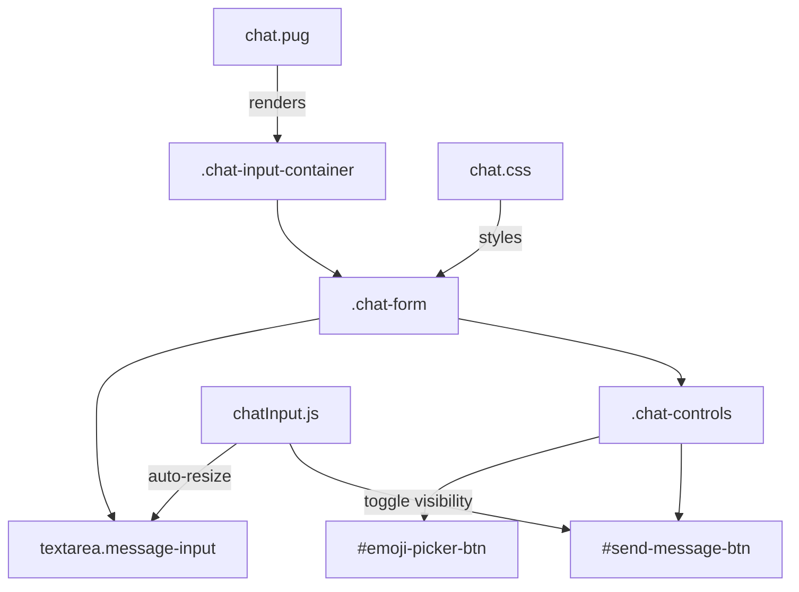

# Design Document: Chat Input Redesign

## Overview

The chat input area on the chat page currently has `display: none` applied to `.chat-input-container`, making it invisible by default. The existing textarea and send button use a basic rectangular layout that does not match the rest of the application's visual language.

This redesign makes the chat input always visible and aligns it visually with the sentbot widget input (`public/css/sentbot.css`). The sentbot input is already well-designed: a pill-shaped outlined form, auto-resizing textarea, and a send button that only appears when text is present. The goal is to replicate that exact pattern in the chat page.

The changes are intentionally scoped to CSS and a small JS module — no backend changes are required.

---

## Architecture

The feature touches three layers:

```
views/chat.pug          ← HTML structure (replace textarea+button with sentbot-style form)
public/css/chat.css     ← Remove display:none, add pill-form styles
public/js/chatInput.js  ← New module: auto-resize + send button toggle logic
public/js/index.js      ← Wire up initChatInput() on chat page load
```

The sentbot widget already implements the same behavior in `public/js/sentbot.js`. The new `chatInput.js` module extracts only the input-specific logic (auto-resize, send button toggle) without the bot API call logic, which remains in `chatController.js`.



---

## Components and Interfaces

### 1. `.chat-input-container` (HTML/CSS)

- Remove `display: none` — always visible
- Add `background: #fff` and `border-top: 1px solid #e2e8f0`
- Padding: `15px 22px 20px` (matching sentbot footer)

### 2. `.chat-form` (HTML/CSS)

Replace the existing `.message-input-wrapper` + `.chat-message-input` + `.send-message-btn` structure with the sentbot-style form:

```pug
form.chat-form
  textarea.message-input(placeholder="Type your message..." required)
  .chat-controls
    button#emoji-picker-btn(type="button")
      i.fas.fa-face-smile
    button#send-message-btn(type="submit")
      i.fas.fa-paper-plane
```

The `required` attribute on the textarea enables the CSS `:valid` selector trick used in sentbot to show/hide the send button without JavaScript for the basic case (JS handles the dynamic resize).

### 3. `chatInput.js` (new JS module)

Exports a single `initChatInput()` function:

```js
export function initChatInput() {
  const messageInput = document.querySelector('.chat-input-container .message-input');
  const sendBtn = document.querySelector('.chat-input-container #send-message-btn');
  if (!messageInput) return;

  const initialHeight = messageInput.scrollHeight;

  messageInput.addEventListener('input', () => {
    messageInput.style.height = `${initialHeight}px`;
    messageInput.style.height = `${messageInput.scrollHeight}px`;
    const form = messageInput.closest('.chat-form');
    if (form) {
      form.style.borderRadius =
        messageInput.scrollHeight > initialHeight ? '15px' : '32px';
    }
  });
}
```

The send button show/hide is handled purely via CSS (`:valid` pseudo-class on the textarea with `required`), matching the sentbot approach.

### 4. `chat.css` updates

Key style changes:

| Selector | Change |
|---|---|
| `.chat-input-container` | `display: none` → `display: block` (or remove the rule) |
| `.chat-form` | New: pill shape, flex, outline |
| `.chat-form .message-input` | New: no border, auto-height, `resize: none` |
| `.chat-form .chat-controls` | New: flex row, right-aligned |
| `.chat-form .chat-controls button` | New: circular, 35×35px |
| `.chat-form .chat-controls #send-message-btn` | New: hidden by default, shown via `:valid` |

Old classes (`.message-input-wrapper`, `.chat-message-input`, `.send-message-btn`) can be removed or left unused.

---

## Data Models

No new data models. The redesign is purely presentational. The existing message send flow in `chatController.js` reads from `#messageInput` — the new textarea will use the same ID or the selector will be updated to `.chat-input-container .message-input`.

---

## Correctness Properties

*A property is a characteristic or behavior that should hold true across all valid executions of a system — essentially, a formal statement about what the system should do. Properties serve as the bridge between human-readable specifications and machine-verifiable correctness guarantees.*

### Property 1: Chat input container is visible on page load

*For any* render of the chat page, the `.chat-input-container` element's computed `display` style SHALL NOT be `none`.

**Validates: Requirements 1.1, 1.2**

---

### Property 2: Chat form has pill shape and default border

*For any* render of the chat page, the `.chat-form` element SHALL have a computed `border-radius` of at least `32px`, a `1px solid` outline, and `display: flex` with `align-items: center`.

**Validates: Requirements 2.1, 2.2, 2.4**

---

### Property 3: Chat form focus outline uses brand color

*For any* child element of `.chat-form` that receives focus, the `.chat-form` element SHALL display a `2px solid` outline with color `#5350c4`.

**Validates: Requirements 2.3, 6.1**

---

### Property 4: Message input style invariants

*For any* render of the chat page, the `.message-input` textarea SHALL have: `min-height: 47px`, `max-height: 180px`, `resize: none`, no visible border or outline of its own, and `font-size: 0.95rem`.

**Validates: Requirements 3.1, 3.3, 3.4, 6.3**

---

### Property 5: Message input auto-resizes within bounds

*For any* text input into the `.message-input` textarea, the element's rendered height SHALL be at least `47px` and at most `180px`, growing as content grows.

**Validates: Requirements 3.2**

---

### Property 6: Send button visibility matches input content

*For any* state of the `.message-input` textarea: when the value is empty the send button SHALL be hidden (`display: none`), and when the value is non-empty the send button SHALL be visible (`display: block` or equivalent).

**Validates: Requirements 4.1, 4.2**

---

### Property 7: Color tokens and container background

*For any* render of the chat page: the `.chat-form` background SHALL be `#fff`, the `#send-message-btn` background SHALL be `#5350c4`, and the `.chat-input-container` SHALL have a `1px solid #e2e8f0` top border with a white background.

**Validates: Requirements 4.3, 6.2, 6.4**

---

### Property 8: Chat controls buttons are circular and minimum sized

*For any* button inside `.chat-controls`, the computed `border-radius` SHALL be `50%` and the width and height SHALL each be at least `35px`.

**Validates: Requirements 5.3**

---

## Error Handling

- If `initChatInput()` is called on a page without `.message-input`, it returns early (guard clause) — no errors thrown.
- If the emoji picker library is unavailable, the emoji button is still rendered but does nothing — no crash.
- The send button visibility fallback is CSS-only (`:valid` on `required` textarea), so it works even if JS fails to load.

---

## Testing Strategy

### Dual Testing Approach

Both unit tests and property-based tests are used. Unit tests cover specific examples and integration points; property tests verify universal style and behavioral invariants.

### Unit Tests

- Verify that `initChatInput()` returns early without error when `.message-input` is absent from the DOM.
- Verify that after calling `initChatInput()`, typing into the textarea triggers a height recalculation.
- Verify that the send button is hidden on initial render (empty textarea).
- Verify that the send button becomes visible after setting a non-empty value and dispatching an `input` event.
- Verify that the `.chat-form` border-radius changes from `32px` to `15px` when content exceeds the initial height.

### Property-Based Tests

Use a property-based testing library (e.g., **fast-check** for JavaScript/Node). Each test runs a minimum of **100 iterations**.

Each test is tagged with:
`// Feature: chat-input-redesign, Property N: <property text>`

| Property | Test Description |
|---|---|
| P1 | For any DOM snapshot of the chat page, `.chat-input-container` computed display ≠ `none` |
| P2 | For any render, `.chat-form` border-radius ≥ 32px, outline is 1px solid, display is flex |
| P3 | For any focusable child of `.chat-form`, focusing it sets `.chat-form` outline to `2px solid #5350c4` |
| P4 | For any render, `.message-input` has correct min/max height, resize:none, no border, font-size 0.95rem |
| P5 | For any string of length 0–500 chars typed into `.message-input`, rendered height stays in [47px, 180px] |
| P6 | For any string value of `.message-input`: empty → send button hidden; non-empty → send button visible |
| P7 | For any render, color tokens on form, send button, and container match spec values |
| P8 | For any button in `.chat-controls`, border-radius is 50% and dimensions ≥ 35×35px |

### Property Test Configuration

```js
// Example: Property 6 - send button visibility
// Feature: chat-input-redesign, Property 6: send button visibility matches input content
fc.assert(
  fc.property(fc.string(), (text) => {
    messageInput.value = text;
    messageInput.dispatchEvent(new Event('input'));
    const isVisible = getComputedStyle(sendBtn).display !== 'none';
    return text.trim().length > 0 ? isVisible : !isVisible;
  }),
  { numRuns: 100 }
);
```
