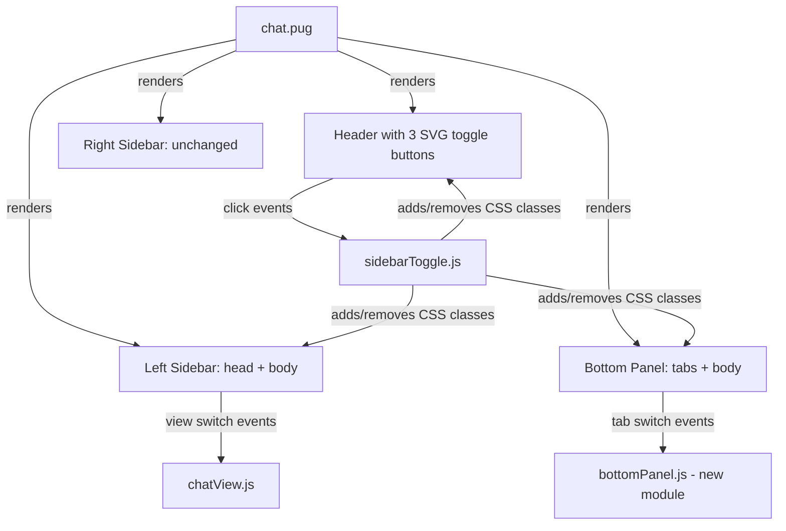

# Design Document: Chat UI Redesign

## Overview

This redesign transforms the SentReader chat page into an IDE-like interface inspired by VS Code's panel layout. The three main changes are:

1. **Header toggle icons** — replace Font Awesome icons with inline SVG panel icons that reflect open/closed state via CSS class
2. **Left sidebar restructure** — remove logo/try-free/recent-chats, add a document-focused header and a two-view body (TOC and Documents)
3. **Bottom panel** — replace the static `.chat-input-container` with a collapsible, tabbed panel that houses chat input and informational tabs

The right sidebar is preserved unchanged.

---

## Architecture

The feature touches three layers:

```
views/chat.pug          ← HTML structure (Pug template)
public/css/chat.css     ← Visual styles and transitions
public/js/
  sidebarToggle.js      ← Panel toggle logic (extended)
  chatView.js           ← DOM rendering helpers (extended for TOC/Docs views)
  chatController.js     ← Wires events; minor additions for new DOM nodes
  index.js              ← Entry point; no changes needed
```



### New module: `public/js/bottomPanel.js`

Rather than overloading `sidebarToggle.js` further, tab-switching logic for the bottom panel lives in a dedicated `bottomPanel.js` module. The collapse/expand toggle (which mirrors sidebar toggle behavior) is handled inside the extended `sidebarToggle.js`.

---

## Components and Interfaces

### 1. Header Toggle Buttons (chat.pug)

Three buttons in `.chat-area-header`:

| Button ID            | Panel controlled  | SVG icon shape                        |
|----------------------|-------------------|---------------------------------------|
| `#toggleLeftSidebar` | `#leftSidebar`    | Rectangle with left column highlighted |
| `#toggleRightSidebar`| `#rightSidebar`   | Rectangle with right column highlighted |
| `#toggleBottomPanel` | `#bottomPanel`    | Rectangle with bottom row highlighted  |

Each button receives the CSS class `panel-icon-btn`. When its panel is open, the button also carries `panel-icon-active`. The SVG is inlined directly in the Pug template so CSS can target `svg path` fill/stroke without an external file dependency.

**SVG icon structure (example — left panel icon):**
```pug
button#toggleLeftSidebar.sidebar-toggle.panel-icon-btn
  svg(width="16" height="16" viewBox="0 0 16 16" fill="none" xmlns="http://www.w3.org/2000/svg")
    rect(x="1" y="1" width="14" height="14" rx="2" stroke="currentColor" stroke-width="1.5")
    rect(x="1" y="1" width="5" height="14" rx="2" fill="currentColor")
```

The filled `rect` shifts position/size for each of the three icons (left column, right column, bottom row).

**CSS active state:**
```css
.panel-icon-btn svg rect:last-child { fill: rgba(currentColor, 0.25); }
.panel-icon-btn.panel-icon-active svg rect:last-child { fill: currentColor; }
```

### 2. Left Sidebar (chat.pug + chat.css)

Replaces the existing left sidebar content entirely.

**New structure:**
```
aside#leftSidebar.chat-sidebar.chat-sidebar-left
  .sidebar-left-head
    span.sidebar-doc-title          ← truncated to 2 words, or "No Document"
    button#sidebarFileBtn           ← file icon (SVG or FA)
    button#sidebarFolderBtn         ← folder icon (SVG or FA)
  .sidebar-left-body
    .sidebar-view.toc-view#tocView  ← default visible
    .sidebar-view.docs-view#docsView ← hidden by default
```

**View switching:** clicking `#sidebarFileBtn` shows `#tocView` and hides `#docsView`; clicking `#sidebarFolderBtn` does the reverse. Active button gets class `sidebar-head-btn-active`.

**TOC view content:** rendered by `chatView.js → renderTocView(dom, ragData)`. Each item is a `<li>` with the section heading text and a `data-section-id` attribute used for scroll targeting.

**Documents view content:** rendered by `chatView.js → renderDocsView(dom, { isEnterprise, documents })`. Non-enterprise users see an upgrade prompt div `.docs-upgrade-prompt`.

### 3. Bottom Panel (chat.pug + chat.css + bottomPanel.js)

Replaces `.chat-input-container`.

**Structure:**
```
#bottomPanel.bottom-panel
  .bottom-panel-tabs
    button.bottom-tab.bottom-tab-active[data-tab="chat"]   CHAT
    button.bottom-tab[data-tab="error"]                    ERROR
    button.bottom-tab[data-tab="token"]                    TOKEN USED
    button.bottom-tab[data-tab="model"]                    MODEL USED
    button.bottom-tab[data-tab="rag"]                      RAG INFO
    button.bottom-tab[data-tab="usage"]                    USAGE LIMIT
    button.bottom-tab[data-tab="subscription"]             SUBSCRIPTION
  .bottom-panel-body
    .bottom-panel-content.bottom-content-active[data-content="chat"]
      form.chat-form ...   ← existing chat input form
    .bottom-panel-content[data-content="error"]
    .bottom-panel-content[data-content="token"]
    .bottom-panel-content[data-content="model"]
    .bottom-panel-content[data-content="rag"]
    .bottom-panel-content[data-content="usage"]
    .bottom-panel-content[data-content="subscription"]
```

**Collapse behavior:** `sidebarToggle.js` adds/removes `.panel-collapsed` on `#bottomPanel`. CSS handles the height transition:

```css
#bottomPanel {
  max-height: 300px;
  transition: max-height 0.3s ease;
  overflow: hidden;
}
#bottomPanel.panel-collapsed {
  max-height: 0;
}
```

**Tab switching:** `bottomPanel.js → initBottomPanel()` listens for clicks on `.bottom-tab` buttons, removes `bottom-tab-active` from all tabs, adds it to the clicked tab, and swaps `bottom-content-active` on the matching content pane.

### 4. Extended sidebarToggle.js

New responsibilities added to `initSidebarToggle()`:

- Query `#toggleBottomPanel` and `#bottomPanel`
- Toggle `.panel-collapsed` on `#bottomPanel` when `#toggleBottomPanel` is clicked
- After every toggle action (left, right, bottom), call `syncPanelIconStates()` which reads the open/closed state of each panel and sets/removes `panel-icon-active` on the corresponding button

```javascript
function syncPanelIconStates() {
  // left
  leftToggle.classList.toggle('panel-icon-active', isOpen(leftSidebar));
  // right
  rightToggle.classList.toggle('panel-icon-active', isOpen(rightSidebar));
  // bottom
  bottomToggle.classList.toggle('panel-icon-active', !bottomPanel.classList.contains('panel-collapsed'));
}
```

`syncPanelIconStates()` is also called once on init to set the correct initial state (bottom panel open by default → bottom toggle active).

---

## Data Models

### TocItem

Represents one entry in the Table of Contents view.

```typescript
interface TocItem {
  id: string;        // unique section identifier (e.g. "section-3")
  label: string;     // display text (e.g. "Chapter 3: Introduction")
  level: number;     // heading depth: 1 = h1, 2 = h2, etc.
}
```

### DocumentEntry

Represents one document in the Documents view (enterprise only).

```typescript
interface DocumentEntry {
  id: string;
  name: string;      // file name
  fileType: string;  // e.g. "PDF"
  fileSize: string;  // human-readable, e.g. "1.2 MB"
  uploadedAt: string; // ISO date string
}
```

### PanelState

Runtime state tracked by `sidebarToggle.js`.

```typescript
interface PanelState {
  leftOpen: boolean;
  rightOpen: boolean;
  bottomOpen: boolean;
}
```

### ActiveTab

Runtime state tracked by `bottomPanel.js`.

```typescript
type TabId = 'chat' | 'error' | 'token' | 'model' | 'rag' | 'usage' | 'subscription';

interface ActiveTab {
  current: TabId;  // default: 'chat'
}
```

---

## Correctness Properties

*A property is a characteristic or behavior that should hold true across all valid executions of a system — essentially, a formal statement about what the system should do. Properties serve as the bridge between human-readable specifications and machine-verifiable correctness guarantees.*

### Property 1: Panel icon state mirrors panel open/closed state

*For any* combination of panel states (left sidebar, right sidebar, bottom panel), the `panel-icon-active` class on each toggle button must be present if and only if its corresponding panel is open.

**Validates: Requirements 1.5, 1.6, 8.1, 8.2, 8.3, 8.4, 8.5, 8.6**

### Property 2: Bottom panel toggle is a round trip

*For any* initial bottom panel state (open or collapsed), clicking the toggle button twice must return the panel to its original state (open → collapsed → open, or collapsed → open → collapsed).

**Validates: Requirements 6.2, 6.3**

### Property 3: Document title truncation

*For any* document title string, the text displayed in `.sidebar-doc-title` must contain at most two whitespace-separated words.

**Validates: Requirements 2.2**

### Property 4: View switching is exclusive

*For any* sidebar state, clicking the file button must result in `#tocView` being visible and `#docsView` being hidden; clicking the folder button must result in `#docsView` being visible and `#tocView` being hidden. Only one view is visible at a time.

**Validates: Requirements 3.2, 4.1**

### Property 5: Enterprise gate on Documents view

*For any* user, when the Documents view is displayed, the rendered content must show the documents list if and only if the user is an enterprise subscriber; otherwise it must show the upgrade prompt.

**Validates: Requirements 4.2, 4.3**

### Property 6: Active tab exclusivity

*For any* tab click in the bottom panel, exactly one tab must carry the `bottom-tab-active` class and exactly one content pane must carry the `bottom-content-active` class, and they must correspond to the same `data-tab` / `data-content` value.

**Validates: Requirements 5.4**

### Property 7: TOC renders from RAG data

*For any* non-empty array of `TocItem` objects passed to `renderTocView`, the rendered list must contain exactly as many `<li>` elements as there are items in the input array, each with a matching `data-section-id`.

**Validates: Requirements 3.3**

### Property 8: Collapsed panel expands chat messages area

*For any* bottom panel state, when `.panel-collapsed` is present on `#bottomPanel`, the computed height of `#bottomPanel` must be 0 (or effectively 0 after transition), and the chat messages area must occupy the freed vertical space.

**Validates: Requirements 6.4**

---

## Error Handling

| Scenario | Behavior |
|---|---|
| `#toggleBottomPanel` not found in DOM | `initSidebarToggle` returns early (existing guard pattern extended) |
| `#bottomPanel` not found in DOM | `initBottomPanel` returns early |
| RAG data is null or empty array | `renderTocView` renders the "no table of contents available" message |
| User subscription data unavailable | Documents view renders upgrade prompt as safe fallback |
| Tab `data-tab` value has no matching content pane | Tab click is a no-op; no active class is applied |
| Document title is empty string | `.sidebar-doc-title` displays "No Document" placeholder |

---

## Testing Strategy

### Unit Tests

Focus on specific examples, edge cases, and integration points:

- Header renders exactly 3 toggle buttons with correct IDs
- Each toggle button contains an SVG element (no Font Awesome icon)
- Left sidebar does NOT contain `.chat-logo`, `.chat-try-free`, or `.recent-chats`
- Left sidebar contains `.sidebar-left-head` with doc title span and two buttons
- Bottom panel renders tab bar with 7 tabs in the correct order
- CHAT tab is active by default on page load
- Bottom panel is expanded (no `.panel-collapsed`) on page load
- `renderTocView` with empty/null data renders the "no TOC" message
- `renderDocsView` with `isEnterprise: false` renders `.docs-upgrade-prompt`
- Right sidebar still contains `#uploadHistoryList` and `#conversationTopicsList`

### Property-Based Tests

Use a property-based testing library (e.g. **fast-check** for JavaScript) with a minimum of 100 iterations per property.

Each test is tagged with the format:
`// Feature: chat-ui-redesign, Property {N}: {property_text}`

**Property 1 — Panel icon state mirrors panel open/closed state**
Generate random sequences of toggle actions (left/right/bottom, any order). After each action, assert that `panel-icon-active` is present on a button if and only if its panel is open.
`// Feature: chat-ui-redesign, Property 1: panel icon active class mirrors panel open state`

**Property 2 — Bottom panel toggle round trip**
Generate a random initial state (open or collapsed). Apply the toggle twice. Assert the final state equals the initial state.
`// Feature: chat-ui-redesign, Property 2: bottom panel toggle is a round trip`

**Property 3 — Document title truncation**
Generate random strings with 0–20 words. Pass each to the title-truncation function. Assert the result contains at most 2 words.
`// Feature: chat-ui-redesign, Property 3: document title truncated to at most two words`

**Property 4 — View switching is exclusive**
Generate random sequences of file-button and folder-button clicks. After each click, assert exactly one of `#tocView` / `#docsView` is visible.
`// Feature: chat-ui-redesign, Property 4: only one sidebar view is visible at a time`

**Property 5 — Enterprise gate on Documents view**
Generate random boolean `isEnterprise` values and random document arrays. Assert that the rendered output contains the documents list iff `isEnterprise` is true, and the upgrade prompt iff `isEnterprise` is false.
`// Feature: chat-ui-redesign, Property 5: enterprise gate controls documents view content`

**Property 6 — Active tab exclusivity**
Generate random sequences of tab clicks (any of the 7 tab IDs). After each click, assert exactly one tab has `bottom-tab-active` and exactly one content pane has `bottom-content-active`, and they share the same ID.
`// Feature: chat-ui-redesign, Property 6: exactly one tab and one content pane are active at a time`

**Property 7 — TOC renders from RAG data**
Generate random arrays of `TocItem` objects (0–50 items). Pass to `renderTocView`. Assert the rendered `<li>` count equals the input array length and each `data-section-id` matches the corresponding item's `id`.
`// Feature: chat-ui-redesign, Property 7: TOC list item count matches RAG data input`

**Property 8 — Collapsed panel height**
Generate random panel states. When `.panel-collapsed` is applied, assert `#bottomPanel` has `max-height: 0` (via computed style or class presence check).
`// Feature: chat-ui-redesign, Property 8: collapsed bottom panel has zero effective height`
