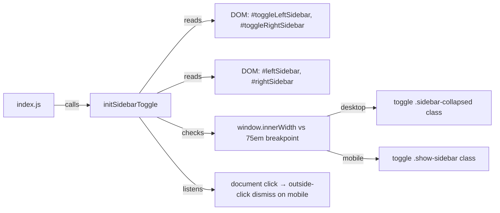

# Design Document: Sidebar Toggle Buttons

## Overview

This feature adds two persistent toggle buttons to the chat page header — one for the left sidebar and one for the right sidebar. Unlike the existing `.mobile-toggle` buttons (which are hidden on desktop via CSS), these new buttons are always visible at every viewport width.

The toggle behavior is viewport-aware:
- **Desktop (>75em):** sidebars are inline by default; toggling applies/removes a `sidebar-collapsed` CSS class that sets `width: 0` and `overflow: hidden`.
- **Mobile/Tablet (≤75em):** sidebars are off-canvas by default; toggling adds/removes the existing `show-sidebar` class that slides them into view via `translateX`.

The JS logic lives in a new `public/js/sidebarToggle.js` module, exported as `initSidebarToggle()`, and wired into `public/js/index.js`. The existing toggle wiring inside `chatController.js` is removed to avoid duplication.

---

## Architecture

The feature touches three layers:

```
views/chat.pug          ← HTML structure: button placement, IDs, icons
public/css/chat.css     ← CSS: sidebar-collapsed rule, remove display:none from .mobile-toggle on desktop
public/js/sidebarToggle.js  ← new module: initSidebarToggle()
public/js/index.js      ← wire: import and call initSidebarToggle()
public/js/chatController.js ← remove duplicate toggle event listeners
```



---

## Components and Interfaces

### 1. `views/chat.pug` — Button Markup

The existing `#toggleLeftSidebar` and `#toggleRightSidebar` buttons already exist in the template with the `.mobile-toggle` class. The change is to remove `.mobile-toggle` from these buttons (or replace it with a new `.sidebar-toggle` class) so they are not hidden on desktop.

Before (current):
```pug
button#toggleLeftSidebar.mobile-toggle.left-toggle
  i.fas.fa-bars
button#toggleRightSidebar.mobile-toggle.right-toggle
  i.fas.fa-history
```

After:
```pug
button#toggleLeftSidebar.sidebar-toggle.left-toggle
  i.fas.fa-bars
button#toggleRightSidebar.sidebar-toggle.right-toggle
  i.fas.fa-history
```

### 2. `public/css/chat.css` — CSS Changes

Two changes:

**a) New `.sidebar-toggle` class** (replaces `.mobile-toggle` for these buttons — always visible):
```css
.sidebar-toggle {
  display: block;          /* always visible */
  background: transparent;
  border: none;
  color: hsl(210, 66%, 60%);
  font-size: 2.4rem;
  cursor: pointer;
  padding: 0.8rem;
  transition: color 0.2s;
}
.sidebar-toggle:hover {
  color: hsl(210, 66%, 40%);
}
```

**b) New `.sidebar-collapsed` class** for desktop collapse:
```css
.sidebar-collapsed {
  width: 0 !important;
  overflow: hidden;
  padding: 0;
}
```

The existing `.mobile-toggle { display: none }` rule is left untouched — it only applies to elements that still carry the `.mobile-toggle` class, which the toggle buttons will no longer have.

### 3. `public/js/sidebarToggle.js` — New Module

Exports a single `initSidebarToggle()` function. Responsibilities:
- Detect viewport mode (desktop vs mobile) via `window.innerWidth` compared to `75 * 16 = 1200px` (matching the existing `75em` breakpoint used in `chatController.js`).
- On left toggle click: close right sidebar if open, then toggle left sidebar.
- On right toggle click: close left sidebar if open, then toggle right sidebar.
- On outside click (mobile only): close any open sidebar.

Interface:
```js
export function initSidebarToggle() { ... }
```

Internal helpers:
```js
function isDesktop() { return window.innerWidth > 1200; }
function openSidebar(el)   { /* desktop: remove .sidebar-collapsed; mobile: add .show-sidebar */ }
function closeSidebar(el)  { /* desktop: add .sidebar-collapsed; mobile: remove .show-sidebar */ }
function isOpen(el)        { /* desktop: !el.classList.contains('sidebar-collapsed'); mobile: el.classList.contains('show-sidebar') */ }
```

### 4. `public/js/index.js` — Wiring

Add import and call:
```js
import { initSidebarToggle } from './sidebarToggle';
// inside DOMContentLoaded:
initSidebarToggle();
```

### 5. `public/js/chatController.js` — Cleanup

Remove the existing toggle event listeners for `dom.toggleLeftBtn` and `dom.toggleRightBtn` and the outside-click handler, since `sidebarToggle.js` now owns that responsibility. The `dom` references (`toggleLeftBtn`, `toggleRightBtn`, `leftSidebar`, `rightSidebar`) in `chatView.js` remain — they are still used by `chatController.js` for closing sidebars after chat selection on mobile.

---

## Data Models

No new data models. The only state is the presence/absence of CSS classes on DOM elements:

| Element | Desktop hidden state | Mobile hidden state | Mobile visible state |
|---|---|---|---|
| `#leftSidebar` | `.sidebar-collapsed` | _(default, no class)_ | `.show-sidebar` |
| `#rightSidebar` | `.sidebar-collapsed` | _(default, no class)_ | `.show-sidebar` |

---

## Correctness Properties

*A property is a characteristic or behavior that should hold true across all valid executions of a system — essentially, a formal statement about what the system should do. Properties serve as the bridge between human-readable specifications and machine-verifiable correctness guarantees.*

### Property 1: Toggle is a round-trip (idempotence over two clicks)

*For any* sidebar element and any viewport mode, clicking its toggle button twice in succession should return the sidebar to its original visibility state.

**Validates: Requirements 2.1, 2.2, 3.2, 3.3, 4.2, 4.3**

### Property 2: Mutual exclusion on mobile

*For any* state where one sidebar is open on a mobile/tablet viewport, clicking the other sidebar's toggle button should result in the first sidebar being closed and the second sidebar being open (only one sidebar open at a time).

**Validates: Requirements 2.3, 2.4**

### Property 3: Outside-click dismissal on mobile

*For any* open sidebar on a mobile/tablet viewport, a click event dispatched on an element that is neither inside the sidebar nor on its toggle button should result in the sidebar being closed.

**Validates: Requirements 4.4**

### Property 4: Desktop collapse applies correct class

*For any* sidebar in its default visible state on a desktop viewport, clicking its toggle button should add the `sidebar-collapsed` class to that sidebar element.

**Validates: Requirements 3.2**

### Property 5: Mobile show applies correct class

*For any* sidebar in its default hidden state on a mobile viewport, clicking its toggle button should add the `show-sidebar` class to that sidebar element.

**Validates: Requirements 4.2**

---

## Error Handling

- If `#toggleLeftSidebar`, `#toggleRightSidebar`, `#leftSidebar`, or `#rightSidebar` are not found in the DOM, `initSidebarToggle()` returns early without throwing.
- The module is only meaningful on the chat page; `index.js` calls it unconditionally but the early-return guard makes it a no-op on other pages.
- Viewport resize between desktop and mobile is not explicitly handled mid-session (consistent with the existing `chatController.js` behavior which also uses a static `window.innerWidth` check at event time).

---

## Testing Strategy

### Unit Tests

Specific examples and edge cases verified with a DOM testing library (e.g., jsdom + Jest or Vitest):

- **Buttons exist in correct positions**: `#toggleLeftSidebar` is a descendant of `.header-left`; `#toggleRightSidebar` is a descendant of `.header-right`.
- **Buttons have correct icons**: left toggle contains `i.fa-bars`; right toggle contains `i.fa-history`.
- **Desktop initial state**: on page load with wide viewport, neither sidebar has `sidebar-collapsed`.
- **Mobile initial state**: on page load with narrow viewport, neither sidebar has `show-sidebar`.
- **Buttons are not hidden**: toggle buttons do not carry `.mobile-toggle` class (which has `display: none` on desktop).

### Property-Based Tests

Use a property-based testing library (e.g., [fast-check](https://github.com/dubzzz/fast-check) for JavaScript) with a minimum of 100 iterations per property.

Each test is tagged with a comment referencing the design property:
`// Feature: sidebar-toggle-buttons, Property N: <property_text>`

**Property 1 test** — Toggle round-trip:
Generate a random sidebar element mock and random viewport mode. Call `toggle()` twice. Assert final class state equals initial class state.
`// Feature: sidebar-toggle-buttons, Property 1: toggle is a round-trip`

**Property 2 test** — Mutual exclusion:
Generate a random initial state (left open, right open, both closed). Simulate clicking one toggle. Assert the other sidebar is closed and the clicked sidebar is open.
`// Feature: sidebar-toggle-buttons, Property 2: mutual exclusion on mobile`

**Property 3 test** — Outside-click dismissal:
Generate a random open sidebar and a random target element that is not inside the sidebar or its toggle. Dispatch a click on that target. Assert the sidebar loses `show-sidebar`.
`// Feature: sidebar-toggle-buttons, Property 3: outside-click dismissal on mobile`

**Property 4 test** — Desktop collapse class:
Generate a sidebar element without `sidebar-collapsed`. Simulate a toggle click in desktop mode. Assert `sidebar-collapsed` is present.
`// Feature: sidebar-toggle-buttons, Property 4: desktop collapse applies correct class`

**Property 5 test** — Mobile show class:
Generate a sidebar element without `show-sidebar`. Simulate a toggle click in mobile mode. Assert `show-sidebar` is present.
`// Feature: sidebar-toggle-buttons, Property 5: mobile show applies correct class`
