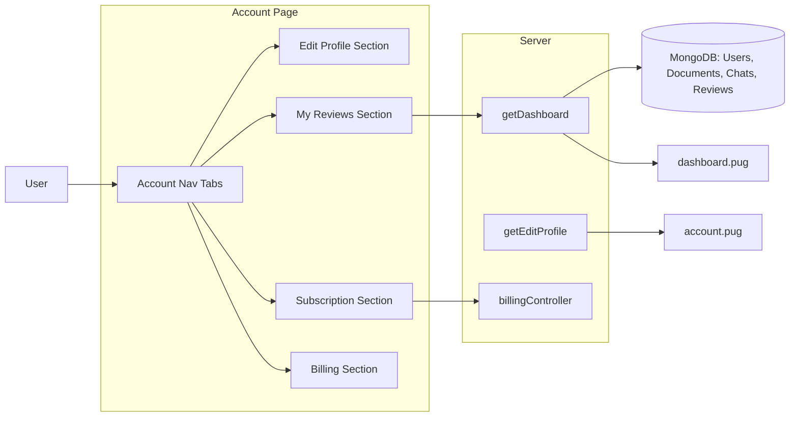

## Goal

Implement **fully functional Account tabs** (Subscription, My reviews, Billing) with actions and ensure the **Dashboard shows real per-user activity** for uploads, chats, and reviews.

## Files to touch

- **Views**
  - `[views/account.pug](views/account.pug)` – add real content for Subscription, My reviews, Billing sections.
  - `[views/dashboard.pug](views/dashboard.pug)` – adjust cards/sections to use new per-user stats (and optionally simplify public/admin parts if needed).
- **Controllers**
  - `[controllers/viewsController.js](controllers/viewsController.js)` – enrich `getEditProfile` (or add a new account view controller) with the data needed for Account tabs; extend `getDashboard` to pull per-user stats for documents and chats.
  - `[controllers/billingController.js](controllers/billingController.js)` – optionally add a simple “billing summary” helper if we want more than what lives on the User model.
  - `[controllers/reviewController.js](controllers/reviewController.js)` – only if we decide to reuse existing review APIs for My reviews actions.
- **Models**
  - `[model/reviewModel.js](model/reviewModel.js)` – already links user/chat/document; may need small helper statics for counts.
  - `[model/documentsModel.js](model/documentsModel.js)` – used to count and list user uploads.
  - `[model/chatsModel.js](model/chatsModel.js)` – used to count and list user chats.
- **Frontend JS**
  - `[public/js/accountTabs.js](public/js/accountTabs.js)` – may need minor enhancements (e.g., scroll to top on tab change or lazy-loading hooks later).
  - `[public/js/dashboard.js](public/js/dashboard.js)` – only if we add/adjust charts based on the new data structure.

## High-level design

- **Account tabs**
  - Keep the current **tabbed layout**: Edit Profile, Subscription, My reviews, Billing in `account.pug`, driven by `data-section` attributes and `accountTabs.js`.
  - Use `res.locals.user` plus new data from `getEditProfile` to render:
    - **Subscription tab**: user’s `subscriptionTier`, `subscriptionStatus`, `trialEndsAt`, `currentPeriodEnd`, and a button that calls existing billing flow (Stripe checkout for upgrade/downgrade) via a simple frontend `fetch`/`axios` to `/api/v1/billing/create-checkout-session`.
    - **My reviews tab**: list of this user’s reviews (similar to dashboard’s recent reviews) with document and chat titles. Initially read-only; we can add edit/delete actions later by hitting existing review routes.
    - **Billing tab**: basic summary of billing-related fields on the User (e.g., `stripeSubscriptionId`, `stripePriceId`, `subscriptionStatus`, `subscriptionTier`, `currentPeriodEnd`) and links to Pricing or Support instead of a full Stripe customer portal.
- **Dashboard per-user activity**
  - For logged-in users, `getDashboard` will:
    - Compute counts and recent items **scoped to `user.id`**:
      - `myDocumentsCount`, `myChatsCount`, `myReviewsCount`.
      - Optionally fetch a small list of recent documents and/or chats to show in tables, similar to recent reviews.
    - Optionally still compute public/admin aggregates (total users, total documents, etc.) for when no user is logged in or the user is an admin, but the primary focus for a normal user is **their own history**.
  - `dashboard.pug` will:
    - Replace or extend the existing “Total reviews / Average rating / Documents reviewed” cards with new metrics (e.g., documents uploaded, chats started, reviews left).
    - Keep the recent reviews table but ensure it’s based on the new `myReviews` data (filtered by user).
    - Continue to expose a single `window.__dashboardData` object that now also includes `myDocumentsCount`, `myChatsCount`, `myReviewsCount`, and any lists we add, so `dashboard.js` can remain simple or be slightly extended.



## Step-by-step plan

### 1) Enrich Account data in `getEditProfile`

- Update `getEditProfile` in `[controllers/viewsController.js](controllers/viewsController.js)` to fetch additional data for the logged-in user:
  - Ensure it uses `res.locals.user` (already set by `isLoggedIn`) and/or explicitly fetches the user from the database to get the latest subscription/billing fields (`subscriptionTier`, `subscriptionStatus`, `currentPeriodEnd`, `trialEndsAt`, etc.).
  - Fetch the user’s recent reviews (e.g., last 5–10) similarly to `getDashboard`:
    - `Review.find({ user: user.id }).populate('document', 'originalFileName').populate('chat', 'title').sort('-createdAt').limit(5)`.
  - Optionally fetch simple billing flags from the User model (no need to hit Stripe again): `stripeSubscriptionId`, `stripePriceId`.
  - Pass these to `account.pug` as locals, e.g., `{ user, accountReviews, accountBilling: { ... } }`.

### 2) Implement real content for Subscription / My reviews / Billing tabs

- **Subscription tab** (in `[views/account.pug](views/account.pug)`):
  - Replace the placeholder paragraph with structured information:
    - Show current tier: `user.subscriptionTier`.
    - Show status: `user.subscriptionStatus`.
    - If available, show trial end date and current period end (`user.trialEndsAt`, `user.currentPeriodEnd`).
  - Add a primary button (e.g., "Upgrade plan" or "Manage subscription") that:
    - On click, calls a small frontend function (which we can put in `public/js/index.js` or a new module) that POSTs the desired tier to `/api/v1/billing/create-checkout-session` and redirects the browser to `res.data.data.url` from Stripe.
    - For now, we can expose two buttons: one for `premium`, one for `enterprise`, or a single button that defaults to upgrading to `premium`.

- **My reviews tab** (in `account.pug`):
  - Replace the placeholder text with a table or list similar to Dashboard’s "Recent reviews":
    - Use `accountReviews` passed from `getEditProfile`.
    - Columns: Document name, Chat title, Rating, Date, and the review text.
  - This section is initially read-only; it simply surfaces what the user already did in the app.

- **Billing tab** (in `account.pug`):
  - Replace the placeholder text with a simple billing summary:
    - Show current plan and status again, plus whether there is an active Stripe subscription (`user.stripeSubscriptionId ? 'Yes' : 'No'`).
    - If available, show the next billing date (`user.currentPeriodEnd`).
    - Provide links to `Pricing` (for plan changes) and `Support` for billing questions.
  - Optionally, reuse the same "Manage subscription" button from the Subscription tab if you want it visible in both places.

### 3) Extend Dashboard controller to reflect real per-user activity

- In `getDashboard` (`[controllers/viewsController.js](controllers/viewsController.js)`):
  - For **logged-in users**:
    - Keep the existing recent reviews query but rename it logically to `userReviews` or keep as `reviews` for the template.
    - Add per-user counts:
      - `const myDocumentsCount = await Document.countDocuments({ user: user.id });`
      - `const myChatsCount = await Chat.countDocuments({ user: user.id });`
      - `const myReviewsCount = await Review.countDocuments({ user: user.id });`
    - Optionally fetch recent documents and chats lists:
      - `const recentDocuments = await Document.find({ user: user.id }).sort('-createdAt').limit(5);`
      - `const recentChats = await Chat.find({ user: user.id }).sort('-createdAt').limit(5);`
  - For **public / admin** views:
    - Keep the existing aggregates (`totalDocuments`, `documentsByType`, `usersByTier`, `publicStats`) so the current behavior for non-logged-in or admin users stays intact.
  - Pass the new fields to `dashboard.pug`, for example:
    - `{ user, reviews, myDocumentsCount, myChatsCount, myReviewsCount, recentDocuments, recentChats, totalDocuments, documentsByType, usersByTier, publicStats }`.

### 4) Update Dashboard view to use new stats

- In `[views/dashboard.pug](views/dashboard.pug)`:
  - For logged-in users (`if user`):
    - Adjust the top summary cards to show **per-user activity** rather than only review-derived metrics:
      - Card 1: "Documents uploaded" → `#{typeof myDocumentsCount !== 'undefined' ? myDocumentsCount : 0}`.
      - Card 2: "Chats started" → `#{typeof myChatsCount !== 'undefined' ? myChatsCount : 0}`.
      - Card 3: "Reviews left" → `#{typeof myReviewsCount !== 'undefined' ? myReviewsCount : 0}` (or keep average rating if you prefer a mix).
    - Keep the "Recent reviews" table as is but ensure it uses the same `reviews` array fetched for this user.
    - Optionally add a small list or secondary table for recent documents or chats using `recentDocuments` / `recentChats` if we decide to surface them.
  - For non-logged-in visitors (`else` branch) and admin analytics, keep the current design but ensure it still receives the expected `publicStats`, `documentsByType`, and `usersByTier` fields from the controller.
  - Update the `window.__dashboardData` block at the bottom to include the new per-user counts and lists, e.g.:

    ```pug
    script.
      window.__dashboardData = {
        user: !{JSON.stringify(user || null)},
        reviews: !{JSON.stringify(reviews || [])},
        publicStats: !{JSON.stringify(publicStats || { totalUsers:0, totalDocuments:0, totalReviews:0 })},
        documentsByType: !{JSON.stringify(documentsByType || [])},
        usersByTier: !{JSON.stringify(usersByTier || { free:0, premium:0, enterprise:0 })},
        myDocumentsCount: !{JSON.stringify(typeof myDocumentsCount !== 'undefined' ? myDocumentsCount : 0)},
        myChatsCount: !{JSON.stringify(typeof myChatsCount !== 'undefined' ? myChatsCount : 0)},
        myReviewsCount: !{JSON.stringify(typeof myReviewsCount !== 'undefined' ? myReviewsCount : 0)}
      };
    ```

- `public/js/dashboard.js` can remain mostly unchanged since it already reads `window.__dashboardData`, but we can later enhance it if we want per-user charts (e.g., charts of user’s documents by type).

### 5) Wire Subscription tab actions to Stripe checkout

- Add a small frontend helper (can live in `public/js/index.js` or a new module like `public/js/billingClient.js`) that:
  - Exposes a function `startCheckout(tier)` that:
    - Sends a POST request to `/api/v1/billing/create-checkout-session` with `{ tier }`.
    - On success, redirects `window.location.href` to the returned `session.url`.
    - Handles errors by showing an alert or fallback message.
  - Attach click handlers in `DOMContentLoaded` (or when Account page is loaded) to the Subscription tab buttons (e.g., `data-tier="premium"`, `data-tier="enterprise"`).
- This reuses the existing `billingController.createCheckoutSession` so we don’t need new backend routes, just a small client-side integration and some markup.

### 6) Manual verification

- **Account tabs**:
  - Navigate to `/editProfile` while logged in.
  - Confirm that Edit Profile is active by default and the other tabs (Subscription, My reviews, Billing) show real data when clicked.
  - In Subscription/Billing, verify that current plan and status match what’s stored on the user in the database.
  - Click an upgrade button and confirm you’re redirected to a valid Stripe checkout URL (assuming keys are configured).
- **Dashboard**:
  - Upload documents and start chats as a logged-in user; leave some reviews.
  - Visit `/dashboard` and check that:
    - The summary cards reflect your **own** number of documents, chats, and reviews.
    - The Recent reviews table lines up with your activity.
  - Log out and load `/dashboard` (or `Overview`) to ensure public stats and charts still work.

## Todos (for this plan)

- **account-tabs-data**: Populate Subscription / My reviews / Billing tabs in `account.pug` with real data from `getEditProfile`, including Stripe upgrade buttons.
- **dashboard-per-user-stats**: Extend `getDashboard` and `dashboard.pug` to show per-user counts (documents, chats, reviews) and keep public/admin aggregates.
- **billing-checkout-integration**: Add frontend logic to start Stripe checkout from the Subscription tab using the existing `/api/v1/billing/create-checkout-session` endpoint.
- **manual-test-dashboard-account**: Manually test Account tabs and Dashboard to verify they show real data and link correctly to uploads, chats, and reviews.