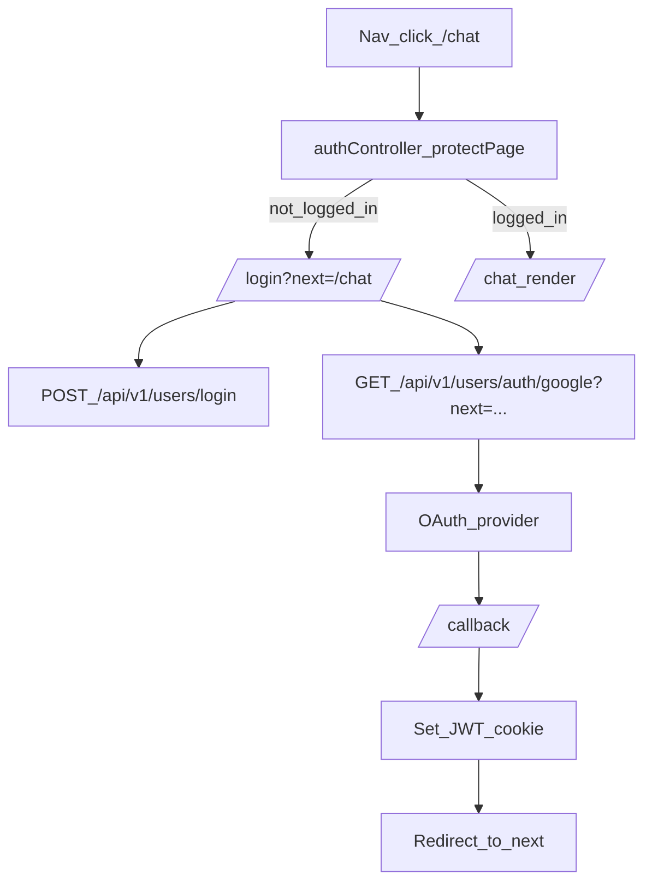

## Auth redirects + full social login

### Goals

- When a logged-out user clicks **Chat** (or any protected page/API-backed page), they see the **Login** page (not a generic error page).
- Login page clearly offers **“No account? Create one”** and Signup offers **“Already have an account? Log in”**.
- Implement **full OAuth social login** for **Google (Gmail)**, **LinkedIn**, **Facebook**, **X (Twitter)**, and **TikTok**.
- After successful login, **redirect back** to the originally requested URL (e.g. `/chat`).

### 1. Add a “protectPage” middleware for rendered routes

- In `controllers/authController.js`, add `protectPage` that:
  - If logged in, calls `next()`.
  - If not logged in, redirects to `/login?next=<originalUrl>`.
- Update rendered routes in `routes/viewRoutes.js` to use `protectPage` instead of API-style `protect` for pages like `/chat`, `/dashboard`, `/editProfile`.

### 2. Preserve and use `next` redirect on login/signup

- Update `views/login.pug` and `views/signup.pug` to:
  - Include a hidden input `next` populated from `req.query.next`.
  - Render cross-links:
    - Login page: “Don’t have an account? Sign up” (preserve `next`).
    - Signup page: “Already have an account? Log in” (preserve `next`).
- Update frontend auth submit handlers in `public/js/index.js` (and/or `public/js/login.js` / `public/js/signup.js`) to include `next` in the request body.
- Update `controllers/authController.js` login/signup responses to accept optional `next` and return it (or just rely on frontend redirect logic).

### 3. Implement backend OAuth with Passport (single backend source of truth)

- Add dependencies: `passport`, provider strategies, and session support as needed.
- Create `controllers/oauthController.js` with:
  - `startProvider(provider)` to kick off OAuth.
  - `handleProviderCallback(provider)` to:
    - Find-or-create a `User` by provider ID/email.
    - Issue your existing JWT cookie (`createSendToken`).
    - Redirect to `next` stored in a signed cookie or `state`.
- Add routes in `routes/userRoutes.js` (or a dedicated `routes/oauthRoutes.js`):
  - `GET /auth/google` + callback
  - `GET /auth/linkedin` + callback
  - `GET /auth/facebook` + callback
  - `GET /auth/x` + callback
  - `GET /auth/tiktok` + callback
- Store `next` safely:
  - Use OAuth `state` parameter containing a signed value, or set an `oauth_next` httpOnly cookie before redirect.

### 4. Update `User` model for social identities

- In `model/userModel.js`, add optional fields:
  - `oauthProviders: { googleId, facebookId, linkedinId, xId, tiktokId }`
  - `emailVerified` (optional, based on provider)
  - Make `password` optional **only** for OAuth-created accounts, while preserving current local signup behavior.

### 5. Add social login buttons in the UI

- Update `views/login.pug` to add buttons/links:
  - “Continue with Google”, “Continue with LinkedIn”, “Continue with Facebook”, “Continue with X”, “Continue with TikTok”
  - Each hits the backend OAuth start route and includes `next`.

### 6. Protect header/nav links for better UX

- Update `views/_header.pug` so when user is not logged in:
  - Clicking “Chat” and “Dashboard” takes them to `/login?next=/chat` or `/login?next=/dashboard`.
  - Keep public pages (pricing/services/features) accessible.

### 7. Verification

- Logged-out user clicking `/chat` → redirected to `/login?next=/chat`.
- Login via email/password → redirected back to `/chat`.
- Signup → redirected back to `next`.
- Each OAuth provider:
  - Starts flow, returns callback, creates/links user, sets JWT cookie, redirects to `next`.

