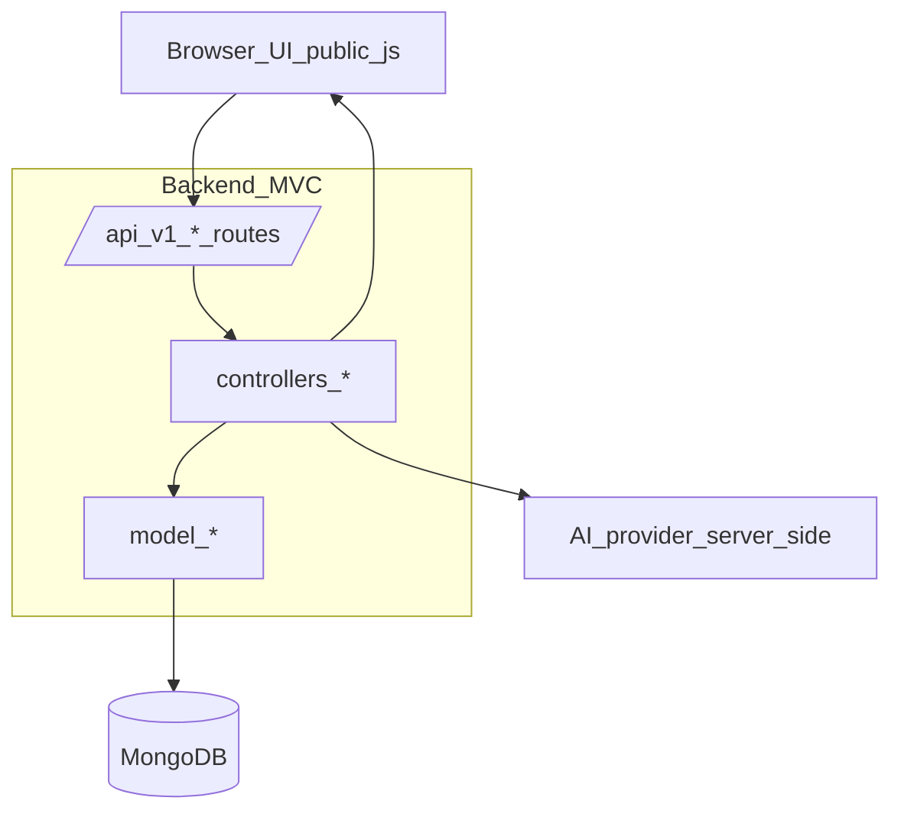

## Backend MVC unification (no `public/js/features/`)

### Target outcome

- **Single source of truth** for application logic lives in backend MVC folders:
  - **Routes**: `routes/*.js` define endpoints and mount middleware.
  - **Controllers**: `controllers/*.js` hold request/response orchestration.
  - **Models**: `model/*.js` hold persistence (Mongoose) + domain methods.
  - **Views**: `views/*.pug` for rendered pages; `controllers/viewsController.js` remains the entry for page rendering.
- **Frontend JS stays minimal**: `public/js/*` only wires DOM events and calls backend endpoints (no duplicate “controllers/models” in frontend folders).

### Key constraints from you

- **No `public/js/features/`** folder.
- **No repeating the same function** in different folders: one controller implementation per domain in `controllers/`, one model per collection/domain in `model/`.
- **Chat + Sentbot** should be **hybrid** (some client state/cache allowed) but still backed by server APIs.
- **Sentbot acts like customer service/agent**: responses should be driven by your database/API (RAG-like retrieval from stored docs/chats) rather than purely client-side calls.
- Add **CORS**.

### 1. Inventory and normalize the backend MVC surface

- **Inspect and fix routing imports** so every route points to the canonical controller file in `controllers/` (e.g. `routes/userRoutes.js` → `controllers/authController.js`, `controllers/userController.js`).
- **Remove/stop using** any backend logic that currently lives in `public/js/`* as “models/controllers” (frontend must call backend endpoints instead).
- **Decide canonical names** and stick to them:
  - `routes/chatRoutes.js` → `controllers/chatController.js`.
  - `routes/billingRoutes.js` → `controllers/billingController.js`.
  - (New or normalized) `routes/sentbotRoutes.js` → `controllers/sentbotController.js`.

### 2. Define clean API boundaries (scalable contracts)

- **Auth/User** (`/api/v1/users/...`)
  - Keep: signup/login/logout, protect/restrictTo, forgot/reset password, update password, update user profile.
- **Chat** (`/api/v1/chats/...`)
  - Canonical endpoints for: create chat, append message, list chats, fetch chat, delete chat/message, and any “hybrid sync” endpoints you already use.
- **Sentbot** (`/api/v1/sentbot/...`)
  - Add a single canonical controller entry (e.g. `POST /api/v1/sentbot/respond`) that:
    - Accepts user prompt + optional chat context identifiers.
    - Retrieves relevant context from DB (documents, prior chats, FAQs).
    - Calls the AI provider (Gemini) **server-side** (avoid exposing `API_KEY` in browser).
    - Stores interaction results if needed (for analytics/history).
- **Billing** (`/api/v1/billing/...`)
  - Canonical endpoints for: create checkout session, webhook (if used), subscription status.

### 3. Make Sentbot “agent/customer service” backed by DB

- **Model layer** (`model/`): ensure you have (or add) schema(s) representing:
  - Knowledge base sources (documents/FAQs) and chat logs.
  - Any embeddings/indexing strategy if present; otherwise start with basic keyword search and upgrade later.
- **Controller flow** (`controllers/sentbotController.js`):
  - Validate input.
  - Query DB for relevant context (documents/snippets/user profile/subscription tier).
  - Build a prompt with citations/snippets.
  - Call AI provider (Gemini) via server.
  - Return response payload to frontend.

### 4. Hybrid client strategy (but backend authoritative)

- Keep frontend-only state limited to:
  - Temporary UI state (open/closed widgets, optimistic message rendering, pagination cursor).
- Make backend authoritative for:
  - Saved chats, final sentbot responses, document context selection.

### 5. CORS

- Add CORS middleware in `app.js`:
  - Use the `cors` package.
  - Configure allowed origins (dev + prod) and `credentials: true` so cookies/JWT can work cross-origin.
  - Ensure preflight requests are handled (`OPTIONS `*).

### 6. Frontend JS cleanup (thin UI callers)

- Refactor `public/js/*` files so they:
  - Only bind DOM events and call backend endpoints.
  - Do **not** duplicate backend controller/model logic.
  - Use one shared client helper (e.g. `public/js/apiClient.js`) if needed for fetch/axios wrappers.

### 7. Verification checklist

- **Server starts** without missing-module errors.
- **Auth**: signup/login/logout, protect routes, password reset.
- **Chat**: create/send/list/delete works; hybrid sync is stable.
- **Sentbot**: browser calls backend; backend fetches DB context; server calls AI; response renders.
- **Billing**: plan click hits backend and redirects/returns session.
- **CORS**: cross-origin calls succeed with cookies/authorization as intended.

