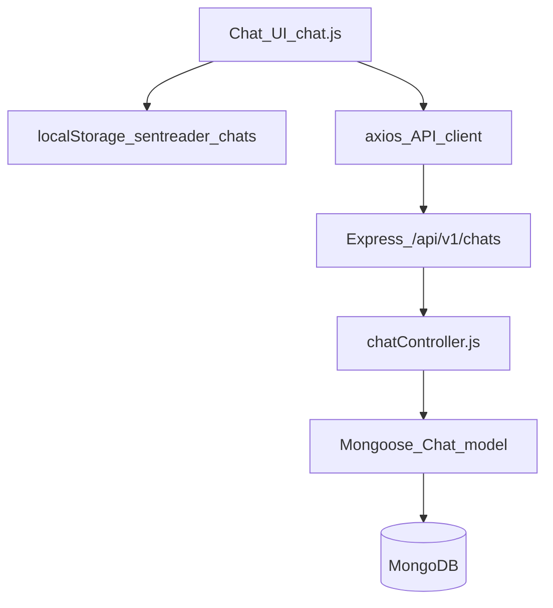

## Goal

Move chat state/logic out of the browser-only demo and into backend MVC so chats persist per logged-in user, while keeping a **hybrid** approach (local cache + server sync) to avoid breaking the current UI.

## What’s there today (key findings)

- The UI is rendered by `[views/chat.pug](c:/Users/Administrator/Desktop/myreader/views/chat.pug)` and initialized via `initChat()` from `[public/js/index.js](c:/Users/Administrator/Desktop/myreader/public/js/index.js)`.
- `[public/js/chat.js](c:/Users/Administrator/Desktop/myreader/public/js/chat.js)` currently:
  - stores chats in `localStorage` (`sentreader_chats`)
  - uses in-memory `chats/currentChatId`
  - simulates AI responses client-side (`simulateAIResponse()`)
- Backend has a Mongoose chat model at `[model/chatsModel.js](c:/Users/Administrator/Desktop/myreader/model/chatsModel.js)`, but `controllers/chatController.js` and `routes/chatRoutes.js` are empty.

## Target MVC architecture

### Backend (server truth)

- **Model**: extend `[model/chatsModel.js](c:/Users/Administrator/Desktop/myreader/model/chatsModel.js)` to support message persistence and client sync:
  - add `clientId` (string) to map localStorage chats ↔ server chats
  - add `messages` as an embedded subdocument array (simplest to ship fast): `{ role: 'user'|'assistant', text, createdAt }`
  - add `updatedAt/lastActivityAt` usage for sync conflict resolution
- **Controller**: implement `[controllers/chatController.js](c:/Users/Administrator/Desktop/myreader/controllers/chatController.js)` with:
  - `getMyChats` (list current user’s chats, newest first)
  - `getChat` (authorize: owner or sharedWith)
  - `createChat` (create empty chat with `clientId`, title/file metadata)
  - `addMessage` (append user message; optionally generate placeholder assistant reply for parity with current demo)
  - `syncChat` (hybrid support: upsert/merge from client cache)
- **Routes**: implement `[routes/chatRoutes.js](c:/Users/Administrator/Desktop/myreader/routes/chatRoutes.js)`:
  - mount at `/api/v1/chats`
  - protect all routes with `authController.protect` like `[routes/userRoutes.js](c:/Users/Administrator/Desktop/myreader/routes/userRoutes.js)`
  - endpoints (proposed):
    - `GET /api/v1/chats`
    - `POST /api/v1/chats`
    - `GET /api/v1/chats/:id`
    - `POST /api/v1/chats/:id/messages`
    - `PUT /api/v1/chats/:id/sync`
- **App wiring**: add the router in `[app.js](c:/Users/Administrator/Desktop/myreader/app.js)`:
  - `const chatRouter = require('./routes/chatRoutes');`
  - `app.use('/api/v1/chats', chatRouter);`

### Frontend (hybrid cache + API)

- Keep `[public/js/chat.js](c:/Users/Administrator/Desktop/myreader/public/js/chat.js)` as the “Controller” for DOM events, but refactor it to use:
  - a small **client ChatModel module** (new file, e.g. `[public/js/chatModel.js](c:/Users/Administrator/Desktop/myreader/public/js/chatModel.js)`) responsible for:
    - loading/saving localStorage cache
    - calling the API via axios (`/api/v1/chats/...`)
    - syncing unsynced chats (on init + after mutations)
  - the existing UI functions become the “View” layer (update lists, render messages)
- Behavior:
  - on page load: try `GET /api/v1/chats`; if success, hydrate cache + render
  - if offline/API fails: fall back to localStorage-only (current behavior)
  - on create chat / send message: update UI immediately, write local cache, then sync in background

## Data flow (high level)

## Compatibility decisions (to avoid breaking UI)

- Preserve the existing chat object shape in the browser as much as possible (`name/title`, `messages`, `timestamp`, `firstUserMessage`) and add mapping fields (`clientId`, `serverId`).
- Keep simulated assistant responses **server-side** (initially) so the browser no longer owns business logic, but the UI stays the same.

## Minimal test/verification steps

- Load `/chat` while logged in and confirm:
  - chats list loads from server (or local fallback)
  - create chat persists across refresh
  - sending a message persists across refresh
  - offline mode still lets you chat locally, then syncs when API works again

