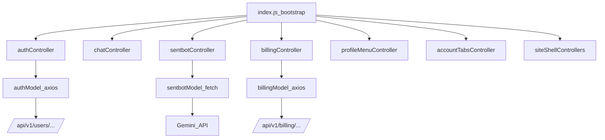

## Goal

Refactor all frontend sections currently coordinated by `[public/js/index.js](c:/Users/Administrator/Desktop/myreader/public/js/index.js)` into a consistent **feature-based MVC** structure:

- **Model**: data + API calls (axios/fetch, local cache)
- **View**: DOM rendering / DOM query helpers
- **Controller**: event wiring + orchestration

Keep the current UI and behavior working (chat, sentbot, billing, profile dropdown, account tabs, auth forms, nav helpers).

## Current state (key findings)

- `[public/js/index.js](c:/Users/Administrator/Desktop/myreader/public/js/index.js)`:
  - Initializes multiple features on `DOMContentLoaded` (chat/sentbot/profile/billing/account tabs).
  - Wires auth forms directly (login, signup, update settings) and also global nav/scroll helpers.
- Feature modules have mixed concerns:
  - `[public/js/sentbot.js](c:/Users/Administrator/Desktop/myreader/public/js/sentbot.js)` mixes DOM, state, rendering, and API calls.
  - `[public/js/billing.js](c:/Users/Administrator/Desktop/myreader/public/js/billing.js)` is small but mixes DOM + API.
  - `[public/js/login.js](c:/Users/Administrator/Desktop/myreader/public/js/login.js)` + `[public/js/signup.js](c:/Users/Administrator/Desktop/myreader/public/js/signup.js)` are API-centric but are wired from `index.js`.
  - `supportAssistant` is currently commented out (no runtime impact) in `[public/js/supportAssistant.js](c:/Users/Administrator/Desktop/myreader/public/js/supportAssistant.js)`.
- Chat has already been moved to MVC modules (`chatModel/chatView/chatController`) and `chat.js` is a wrapper.

## Target folder structure (feature MVC)

Create `public/js/features/` with one folder per feature:

- `features/auth/`
  - `authModel.js` (login/signup/logout/update settings API)
  - `authController.js` (form binding + redirects)
- `features/chat/` (already exists conceptually; we will optionally move/alias)
  - keep current `chatModel.js`, `chatView.js`, `chatController.js` (or relocate with thin re-exports)
- `features/sentbot/`
  - `sentbotModel.js` (API calls to Gemini endpoint, request building)
  - `sentbotView.js` (create message elements, streaming text rendering, UI toggles)
  - `sentbotController.js` (event handlers, state machine, orchestration)
- `features/billing/`
  - `billingModel.js` (create checkout session)
  - `billingController.js` (bind `[data-plan-tier]` clicks)
- `features/profileMenu/`
  - `profileMenuController.js` (dropdown open/close wiring)
- `features/accountTabs/`
  - `accountTabsController.js`
- `features/siteShell/`
  - `navController.js` (mobile nav toggle)
  - `scrollController.js` (hash links / smooth scroll)
  - `layoutController.js` (flex-gap detection)

Keep existing import paths working by using **compatibility wrappers** (like `public/js/chat.js` currently does).

## Bootstrapping changes

- Refactor `[public/js/index.js](c:/Users/Administrator/Desktop/myreader/public/js/index.js)` into a thin bootstrapper:
  - `initFeatures()` that calls each feature controller’s `init...()`
  - auth controller binds forms if present
  - site shell controllers bind once

## Authentication “professional structure”

- Centralize axios calls and consistent error parsing in `features/auth/authModel.js`.
- Controller handles:
  - `.form--login` submit → `authModel.login()`
  - `.form--signup` submit → `authModel.signup()` (keep button loading state)
  - `#logout` click → `authModel.logout()`
  - `.form-user-data` + `.form-user-password` submit → `authModel.updateSettings()`
- Keep using existing `[public/js/alerts.js](c:/Users/Administrator/Desktop/myreader/public/js/alerts.js)` for UX.

## Sentbot MVC split (high value refactor)

Split `[public/js/sentbot.js](c:/Users/Administrator/Desktop/myreader/public/js/sentbot.js)` into:

- **Model**: `generateBotResponse(contents, apiKey, apiUrl)` (pure network + parsing)
- **View**: `createMessageElement`, `streamText`, DOM setters
- **Controller**: state (`userData`, `chatHistory`) + event listeners (keydown, file upload, toggler)

## Migration strategy (safe / incremental)

- Step 1: Create new feature MVC files for auth + billing + sentbot + site shell.
- Step 2: Turn existing root-level modules (`login.js`, `signup.js`, `billing.js`, `sentbot.js`, `toggleProfile.js`, `accountTabs.js`) into wrappers that re-export from the new feature controllers/models.
- Step 3: Update `public/js/index.js` imports to point to the wrapper entrypoints (or directly to feature controllers once stable).
- Step 4: Build bundle (`npm run build:js`) and do quick smoke checks.

## Verification checklist

- Login / signup forms still submit and show alerts.
- Logout works and reloads.
- Update profile data/password works.
- Billing plan buttons redirect to Stripe session URL (or show auth error).
- Sentbot widget still opens/closes, sends messages, handles file upload + emoji picker.
- Chat continues to work (clear/delete, topics + doc name, hybrid sync).
- No JS errors on pages that don’t contain specific feature DOM.

## Data-flow overview

