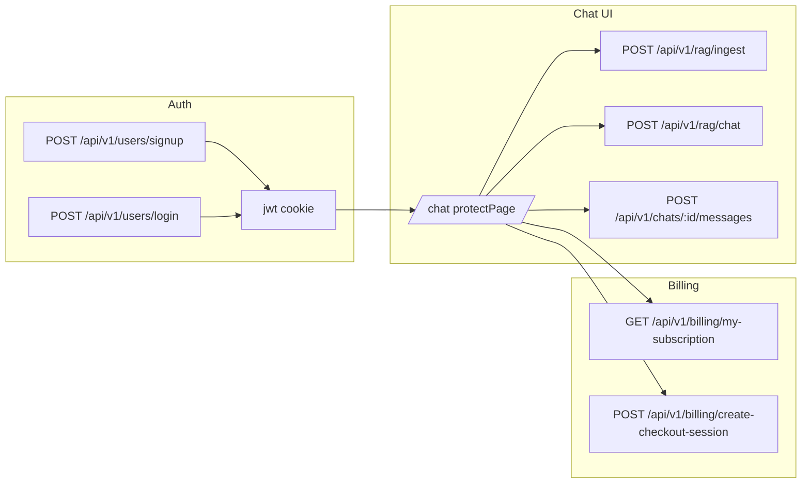

# Manual E2E, RAG sample, full Amharic + theme parity, guided tour, responsive UI

## Scope summary

| Track            | Goal                                                                                                                                                                                                                                                                                                                                                                                               |
| ---------------- | -------------------------------------------------------------------------------------------------------------------------------------------------------------------------------------------------------------------------------------------------------------------------------------------------------------------------------------------------------------------------------------------------- |
| A. E2E / bugs    | Run server, exercise flows, fix failures.                                                                                                                                                                                                                                                                                                                                                          |
| B. RAG sample    | Canonical PDF `[user-agreement-7-1.pdf](c:\Users\Administrator\Desktop\myreader\user-agreement-7-1.pdf)` for RAG smoke tests (+ optional `dev-data/samples/` copy).                                                                                                                                                                                                                                |
| C. Language      | **Amharic** for every user-visible string; one i18n source (`[utils/languageSupport.js](c:\Users\Administrator\Desktop\myreader\utils\languageSupport.js)` or JSON locales). Includes *all `tour.` keys** (Track F). FR/AR can fall back to EN until filled.                                                                                                                                       |
| D. Theme         | Theme toggle + related **aria** and labels use the **same i18n system** as language (Amharic when `lang=am`).                                                                                                                                                                                                                                                                                      |
| E. Responsive UI | Mobile / tablet / desktop polish using `[theme-system.css](c:\Users\Administrator\Desktop\myreader\public\css\theme-system.css)`, `[queries.css](c:\Users\Administrator\Desktop\myreader\public\css\queries.css)`, `[chat.css](c:\Users\Administrator\Desktop\myreader\public\css\chat.css)`, sidebars.                                                                                            |
| F. Web tour      | **Guided tour** in the **root** app: same **translation depth** as the rest of the site (every step title/description, `nav.tour`, tooltips, **Skip / Previous / Next / Finish**, **Close** `aria-label`, progress). Same **visual theme** as the app (tokens + `html[data-theme='dark']` for backdrop, spotlight, card, buttons) and **responsive** tour UI (e.g. bottom sheet on small screens). |

---

## Track A — Manual end-to-end verification and bug fixes

### What exists today

- No Playwright/Cypress in root. Vitest covers `[public/js/**/*.test.js](c:\Users\Administrator\Desktop\myreader/vitest.config.js)` only; `[myreader1/](c:\Users\Administrator\Desktop\myreader/myreader1)` is excluded.

- RAG client: `[public/js/chatController.js](c:\Users\Administrator\Desktop\myreader/public/js/chatController.js)`. Billing: `[public/js/billing.js](c:\Users\Administrator\Desktop\myreader/public/js/billing.js)`. Sentbot analytics: internal POST from `[controllers/ragController.js](c:\Users\Administrator\Desktop\myreader/controllers/ragController.js)`.

### Phase A1 — Checklist (after execution approval)

1. **Config**: `[config.env](c:\Users\Administrator\Desktop\myreader/config.env)` — `DATABASE`, `JWT_SECRET`, `PORT`, embeddings (`API_KEY` / URLs per `[services/embeddingsService.js](c:\Users\Administrator\Desktop\myreader/services/embeddingsService.js)`). Vectors: Pinecone optional; else file-backed store in `[services/vectorService.js](c:\Users\Administrator\Desktop\myreader/services/vectorService.js)`.
2. **Signup / login** — cookies + `meta[name="user-id"]` in `[views/base.pug](c:\Users\Administrator\Desktop\myreader/views/base.pug)`.
3. **RAG** — upload sample PDF (Track B), ingest + chat.
4. **Billing** — `/pricing`, `/account`; 503 if Stripe unset is expected (`[controllers/billingController.js](c:\Users\Administrator\Desktop\myreader/controllers/billingController.js)`).

### Phase A2 — Fix failures

- Auth/cookies, RAG pipeline, `RagDocument` `userId` string consistency (`String(req.user.id)` on queries if 404s), safe JSON on RAG `fetch` in chat client, billing `withCredentials` if needed.

---

## Track B — RAG sample document (`user-agreement-7-1.pdf`)

- **Source path (your machine)**: `C:\Users\Administrator\Desktop\myreader\user-agreement-7-1.pdf`. If the file is not in git, **copy** it into the repo e.g. `[dev-data/samples/user-agreement-7-1.pdf](c:\Users\Administrator\Desktop\myreader/dev-data/samples/user-agreement-7-1.pdf)` (add folder if missing) so E2E is repeatable on other machines.
- **Usage**: Document in `[TODO.md](c:\Users\Administrator\Desktop\myreader/TODO.md)` or dev README snippet — “default RAG smoke file”. Optionally extend `[dev-data/import-dev-data-fixed.js](c:\Users\Administrator\Desktop\myreader/dev-data/import-dev-data-fixed.js)` only if you want a **seed user** to reference this doc (only if product requirements need preloaded RAG data).
- **Manual E2E**: Step 4 explicitly uses this file for upload + Q&A (e.g. questions about clauses in the agreement).

---

## Track C — Amharic and full-site translation

### Current state

- `[utils/languageSupport.js](c:\Users\Administrator\Desktop\myreader/utils/languageSupport.js)`: Amharic exists for a **small** set of RAG-related keys only.
- `[app.js](c:\Users\Administrator\Desktop\myreader/app.js)` sets `res.locals.t` via `[langSupport.getLocalizedCopy](c:\Users\Administrator\Desktop\myreader/utils/languageSupport.js)` — but most templates (e.g. `[views/_header.pug](c:\Users\Administrator\Desktop\myreader/views/_header.pug)`) still use **hardcoded English**.
- `[public/js/language-manager.js](c:\Users\Administrator\Desktop\myreader/public/js/language-manager.js)`: allows `en`, `am`, `fr`, `ar` but does not translate dynamic UI.

### Implementation approach

1. **Key catalog**: Namespace keys (`nav.chat`, `nav.dashboard`, `nav.tour`, `profile.logout`, `chat.placeholder`, `pricing.cta`, …) covering every Pug template under `[views/](c:\Users\Administrator\Desktop\myreader/views)`, plus **all** user-visible strings in `[public/js/*.js](c:\Users\Administrator\Desktop\myreader/public/js)` (alerts, errors, dynamic DOM, Sentbot copy where applicable). **Tour-specific**: every `tour.`* step key (see Track F) must exist in **en** and **am** with full prose — no English leftovers in the tour when Amharic is selected.
2. **Server**: Expand `LOCALIZED_COPY` (or split into JSON files required by `languageSupport.js`). Replace hardcoded strings in Pug with `t('key')` / `#{t('key')}` as appropriate.
3. **Client**: Inject a compact JSON dictionary on `base.pug` (e.g. `window.__I18N__ = { en: {...}, am: {...} }` for client-only keys) **or** share generated JSON from build — keep one authoritative translation table to avoid drift.
4. **Amharic quality**: Professional, consistent terminology (Ge’ez script for body copy; keep agreed Latin tokens for product names per existing RAG prompt note in `LANGUAGE_META.am`).
5. **FR/AR**: Either stub keys to English or leave `t` fallback to `en` until translated.

---

## Track D — Theme strings with same coverage as language

- **Requirement**: Any string that changes meaning with “appearance” (Light/Dark, “Switch theme”, section titles for theme-related UI) must go through the **same i18n mechanism** as language, so when `lang=am`, theme controls are also Amharic.
- **Files**: `[public/js/theme-manager.js](c:\Users\Administrator\Desktop\myreader/public/js/theme-manager.js)` (`updateToggle`, `aria-label`), `[views/_header.pug](c:\Users\Administrator\Desktop\myreader/views/_header.pug)` theme button markup if static labels exist, `[views/base.pug](c:\Users\Administrator\Desktop\myreader/views/base.pug)` inline script only if needed for FOUC (keep minimal).
- **Behavior**: On `myreader:theme-change` or language change, re-apply localized theme labels (listen to language manager or `data-language` mutation).

---

## Track E — Responsive / futuristic UI (mobile, tablet, desktop)

- **Audit breakpoints** in `[public/css/queries.css](c:\Users\Administrator\Desktop\myreader/public/css/queries.css)` and chat-specific rules in `[public/css/chat.css](c:\Users\Administrator\Desktop\myreader/public/css/chat.css)`; align with `[public/css/theme-system.css](c:\Users\Administrator\Desktop\myreader/public/css/theme-system.css)` tokens.
- **Navigation**: Collapsible / hamburger or equivalent for small widths if the current `[views/_header.pug](c:\Users\Administrator\Desktop\myreader/views/_header.pug)` nav overflows; ensure language + theme remain reachable.
- **Chat layout**: Left/right sidebars + bottom panel behavior on narrow viewports (already partially handled in `[public/js/sidebarToggle.js](c:\Users\Administrator\Desktop\myreader/public/js/sidebarToggle.js)` — verify 768px / 1024px / 1200px behaviors).
- **Polish**: Consistent radii, shadows, motion (respect `prefers-reduced-motion`), larger hit targets on touch devices, `env(safe-area-inset-*)` for notched phones.
- **Amharic + layout**: Verify long Amharic strings wrap correctly (RTL not required for Ge’ez, but line-height and overflow need testing).
- **Guided tour (Track F)**: Tour card must not overflow small viewports; touch-friendly actions; spotlight readable in both themes.

---

## Track F — Guided web tour (translation + theme, in detail)

### Current state

- The **root** app (`myreader`) does **not** yet ship a guided tour in `[views/](c:\Users\Administrator\Desktop\myreader/views)` / `[public/js/](c:\Users\Administrator\Desktop\myreader/public/js)`.
- A full reference implementation exists under `**myreader1`**: step definitions and runtime in `[myreader1/client/src/features/tour/tour.page.js](c:\Users\Administrator\Desktop\myreader\myreader1\client\src\features\tour\tour.page.js)`, English/Amharic strings co-located with preferences copy in `[myreader1/client/src/features/preferences/preferences.page.js](c:\Users\Administrator\Desktop\myreader\myreader1\client\src\features\preferences\preferences.page.js)`, header trigger in `[myreader1/_header.pug](c:\Users\Administrator\Desktop\myreader\myreader1\_header.pug)` (`#tourToggle`, `t('nav.tour')`), and themed/responsive styles under `.app-tour__*` in `[myreader1/public/css/style.css](c:\Users\Administrator\Desktop\myreader\myreader1\public\css\style.css)` (including `html[data-theme='dark']` rules).

### Requirements (same bar as language + theme for the rest of the site)

1. **Translation**: Every tour string in **English and Amharic**, including:
  - Chrome: progress (`tour.progress` with `{{current}}` / `{{total}}`), **Skip**, **Previous**, **Next**, **Finish**, close button **aria-label**, optional **title** on the dialog.
  - **Per-step** `titleKey` / `descriptionKey` for each route (overview, login, signup, dashboard, pricing, services, features, account, chat, Sentbot, etc.) — align step list with **actual** root DOM (selectors may differ from `myreader1`; add stable `id`s in Pug where needed, e.g. wrapper around language/theme controls for the first step).
2. **Theme**: Tour UI must use **shared design tokens** (`[public/css/theme-system.css](c:\Users\Administrator\Desktop\myreader\public\css\theme-system.css)`) and explicit **dark** rules so backdrop, card, text, and primary/ghost buttons match the rest of the app in both `data-theme` values.
3. **Language switching**: If the user changes language while the tour is open, **re-resolve** visible strings from the same i18n map (same pattern as Track D for theme).
4. **Responsive**: On narrow viewports, position the card so it does not cover critical nav; prefer bottom-anchored or full-width sheet patterns (mirror the responsive ideas in `myreader1` CSS, adapted to root breakpoints).

### Implementation sketch (root app)

- Add `**public/js/tour.js`** (or a module imported from `[public/js/index.js](c:\Users\Administrator\Desktop\myreader\public\js\index.js)`) porting `initTour` logic from `tour.page.js`, reading strings from `**window.__I18N__`** / shared helper used by Track C (avoid duplicating EN/AM tables).
- Add `**.app-tour__***` rules to root CSS (new partial or `[public/css/style.css](c:\Users\Administrator\Desktop\myreader\public\css\style.css)` / `[theme-system.css](c:\Users\Administrator\Desktop\myreader\public\css\theme-system.css)`) using CSS variables.
- Add `**#tourToggle**` (and optional `aria-label` / tooltip key) to `[views/_header.pug](c:\Users\Administrator\Desktop\myreader\views\_header.pug)` next to language/theme; label via `t('nav.tour')` once Pug i18n exists.

---

## Execution order (when you approve implementation)

1. Track B (sample PDF in repo + E2E doc note) — quick, unblocks consistent RAG tests.
2. Track A Phase A1–A2 — fix blocking bugs.
3. Track C + D — i18n/theme foundation (header, auth, then rest); *define all `tour.` + `nav.tour` keys** in the same catalog as the rest of the site.
4. **Track F** — implement tour JS + CSS + header trigger; wire to i18n; verify EN/AM and theme toggle while tour is open.
5. Track E — responsive pass for **global layout + tour card** once copy and tour structure are stable.
6. `npm test` and a final manual pass on **phone + tablet + desktop** with **Amharic** selected, including **full tour** in **light and dark** themes.

---

## Out of scope (unless you ask later)

- Playwright/Cypress automation.
- Full translation parity for FR/AR (Amharic is the priority for “every part”).
- Fixing `[myreader1/](c:\Users\Administrator\Desktop\myreader/myreader1)` subtree.

