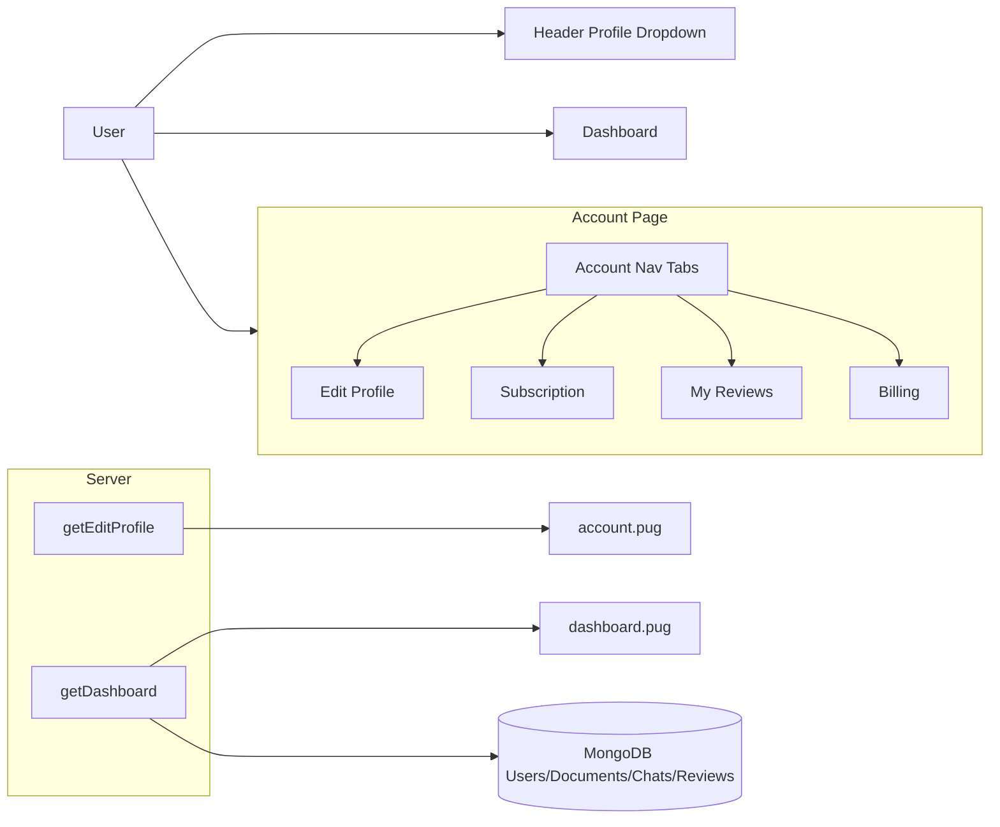

## Goal

Make the **profile status badges** clearly reflect the user’s subscription, ensure the **Dashboard shows accurate private per-user activity and public aggregates**, and **upgrade the UI/UX** of the Account tabs so each nav item (Subscription, My reviews, Billing) shows detailed, real data for the current user.

## Files to touch

- **Views / Layout**
  - `[views/_header.pug](views/_header.pug)` – improve profile status badge content/icons.
  - `[views/dashboard.pug](views/dashboard.pug)` – refine per-user vs public dashboard sections and, if needed, add more detailed tables/cards.
  - `[views/account.pug](views/account.pug)` – polish the Subscription / My reviews / Billing tab layouts and detail sections.
- **Controllers**
  - `[controllers/viewsController.js](controllers/viewsController.js)` – verify/extend `getDashboard` and `getEditProfile` to supply all needed per-user data.
  - (Potentially) upload/chat controllers like `[controllers/documentsController.js]` and `[controllers/chatController.js]` if needed to ensure documents/chats are stored with the correct `user` reference.
- **Models**
  - `[model/userModel.js](model/userModel.js)` – confirm/use subscription fields (`subscriptionTier`, `subscriptionStatus`, `trialEndsAt`, `currentPeriodEnd`, etc.).
  - `[model/documentsModel.js](model/documentsModel.js)` – confirm per-user document ownership and timestamps for dashboard counts.
  - `[model/chatsModel.js](model/chatsModel.js)` – confirm per-user chat ownership and timestamps for dashboard counts.
  - `[model/reviewModel.js](model/reviewModel.js)` – already links user/chat/document; re-use for per-user review counts and lists.
- **Frontend CSS/JS**
  - `[public/css/style.css](public/css/style.css)` – tweak profile badge styling and possibly dashboard visuals.
  - `[public/css/account.css](public/css/account.css)` – modernize Subscription / My reviews / Billing tab styling.
  - `[public/js/accountTabs.js](public/js/accountTabs.js)` – ensure tab behavior works smoothly when sections become more detailed.

## High-level design

- **Profile status badges**
  - Continue rendering the profile dropdown in `_header.pug`, but:
    - Use **human-friendly labels and icons** based on `user.subscriptionTier` (`free`, `premium`, `enterprise`) and `user.subscriptionStatus` (`active`, `cancelled`, etc.).
    - Add conditional icon classes (e.g., Font Awesome `fa-crown` for premium, `fa-building` for enterprise) inside the badges.
    - Only show each badge if the underlying data exists to avoid blank/ugly states.
- **Dashboard: private per-user vs public view**
  - For **logged-in users**, the Dashboard will highlight **their activity**:
    - Counts: documents uploaded, chats started, reviews left (already partially wired, but we’ll verify against real storage paths and data flow).
    - Optional additional lists: recent documents, recent chats, recent reviews, all filtered by the current user.
  - For **visitors (not logged in)**, the Dashboard (or Overview) shows global aggregates:
    - Total users, total documents, total reviews, and a chart of users by subscription tier.
  - Admin users can still see more advanced aggregate analytics (documents by type, users by tier) as currently configured.
- **Account tabs UI/UX (Subscription, My reviews, Billing)**
  - Keep the current **single-page tabbed layout** in `account.pug` (Edit Profile, Subscription, My reviews, Billing) controlled by `accountTabs.js`.
  - Upgrade each tab’s layout to feel like a modern panel:
    - **Subscription**: status card + plan details + clear upgrade/management actions.
    - **My reviews**: styled list/table similar to dashboard reviews, but focused only on the current user, possibly with summary badges.
    - **Billing**: concise summary of billing state, upcoming renewal, and links to Pricing/Support.
  - Ensure that each tab uses **the same underlying data** as the Dashboard when applicable, so numbers are consistent.

## Step-by-step plan

### 1) Enhance profile status badges in `_header.pug`

- In `[views/_header.pug](views/_header.pug)`, update the `.profile-status` block:
  - Instead of rendering raw `user.subscriptionTier` and `user.subscriptionStatus` strings directly, wrap them in **semantic badge content** such as "Free", "Premium", "Enterprise" and "Active", "Canceled", etc.
  - Add icon markup inside each badge, for example:
    - Free: a simple check or leaf icon.
    - Premium: a crown icon.
    - Enterprise: a building/briefcase icon.
  - Use conditional rendering to only show a badge when its value is present, and apply different CSS modifier classes (e.g., `.status-premium`, `.status-enterprise`) based on `subscriptionTier` for color and icon variations.
- In `[public/css/style.css](public/css/style.css)`, enhance `.status-badge` styles:
  - Add variants (e.g., `.status-premium`, `.status-enterprise`, `.status-trial`) with distinct colors.
  - Ensure badges remain legible in the dropdown background and are visually distinct.

### 2) Confirm and tighten Dashboard data for current user

- In `[controllers/viewsController.js](controllers/viewsController.js)` `getDashboard`:
  - **Verify and, if needed, correct queries** that compute:
    - `myDocumentsCount` using `Document.countDocuments({ user: user.id })`.
    - `myChatsCount` using `Chat.countDocuments({ user: user.id })`.
    - `myReviewsCount` using `Review.countDocuments({ user: user.id })`.
  - Ensure that the controllers used for uploads and chats (e.g., document upload and chat creation endpoints) actually create `Document` and `Chat` records with the `user` field set to `req.user.id`. If they don’t, adjust those controllers so future data is correctly linked to the current user.
  - Optionally fetch `recentDocuments` and `recentChats` for the user to support more detailed tables on the dashboard.
  - Keep existing **public/global aggregates** (totalDocuments, documentsByType, usersByTier, publicStats) for non-logged-in and admin views.

### 3) Refine Dashboard view layout

- In `[views/dashboard.pug](views/dashboard.pug)`:
  - For **logged-in users**:
    - Keep the three summary cards but ensure they map directly to `myDocumentsCount`, `myChatsCount`, and `myReviewsCount`.
    - Optionally add a second row or section beneath the summary cards to show:
      - A small list of recent documents (name, type, uploaded date).
      - A small list of recent chats (title, last activity, messages count if available).
  - For **non-logged-in users**:
    - Keep the existing Total Users / Total Documents / Total Reviews cards.
    - Keep the "Users by Subscription Tier" chart powered by `usersByTier`.
  - For **admin analytics**:
    - Preserve the existing documents-by-type and users-by-tier lists and charts.
  - Ensure `window.__dashboardData` continues to export both per-user data and global aggregates so `dashboard.js` remains compatible and can be extended later.

### 4) Upgrade UI for Account tabs (Subscription / My reviews / Billing)

- In `[views/account.pug](views/account.pug)`:
  - **Subscription tab**:
    - Replace basic text with a **card-style layout** that clearly shows:
      - Current plan name and badge (free/premium/enterprise).
      - Status (active/cancelled/pending) with a status pill similar to the header badges.
      - Trial end and current period end dates if available.
    - Place the existing upgrade buttons into a visually clear actions row with supporting text explaining what happens when upgrading.
  - **My reviews tab**:
    - Ensure the table uses `accountReviews` from `getEditProfile` and visually matches the dashboard table styling.
    - Optionally add a top summary: total reviews count and average rating for this user’s reviews.
  - **Billing tab**:
    - Create a two-column layout or stacked cards that show:
      - Subscription tier and status.
      - Whether there is an active Stripe subscription ID.
      - Next billing date and trial end if present.
      - Clear links/buttons for viewing pricing and contacting support.
  - Use `[public/css/account.css](public/css/account.css)` to improve spacing, typography, and card styling within these sections while maintaining the existing brand look.

### 5) Ensure Account data matches Dashboard data

- In `[controllers/viewsController.js](controllers/viewsController.js)` `getEditProfile`:
  - Confirm it uses `res.locals.user` (or refetches the user by ID) to get the latest subscription and billing fields.
  - Confirm it loads `accountReviews` using the same filter as the dashboard (`Review.find({ user: user.id })`) so counts/rows match between Account → My reviews and the Dashboard recent reviews section.
  - If needed, also pass small aggregates (e.g., `myDocumentsCount`, `myChatsCount`) into `account.pug` so you can display subtle counters in the tabs or headers.

### 6) Manual verification strategy

- **Profile dropdown**:
  - Log in as users with different `subscriptionTier` and `subscriptionStatus` values (mocked or real) and verify badges and icons update correctly.
- **Dashboard**:
  - As a logged-in user, upload documents, start chats, and leave reviews, then check that dashboard counts and lists match exactly what is stored in MongoDB for your `user.id`.
  - As a visitor (logged out), confirm that only public/global stats and charts show and no private per-user detail is leaked.
- **Account tabs**:
  - On `/editProfile`, switch between Subscription / My reviews / Billing and verify that:
    - Each tab shows data consistent with the Dashboard and database.
    - Upgrade buttons still start Stripe checkout correctly.
    - Layout is clean and readable on desktop and mobile.

## Todos

- **profile-badges-ui**: Improve profile status badges in `_header.pug` and `style.css` with icons and conditional styles based on `subscriptionTier` and `subscriptionStatus`.
- **dashboard-data-linkage**: Verify and correct how uploads, chats, and reviews are stored and queried so `getDashboard` shows accurate per-user and public data.
- **account-tabs-ui-upgrade**: Modernize the UI of Subscription / My reviews / Billing tabs in `account.pug` + `account.css` using the enriched data from `getEditProfile`.
- **account-dashboard-consistency-test**: Manually test that Account tabs and Dashboard show consistent, correct data per user and for public visitors.

